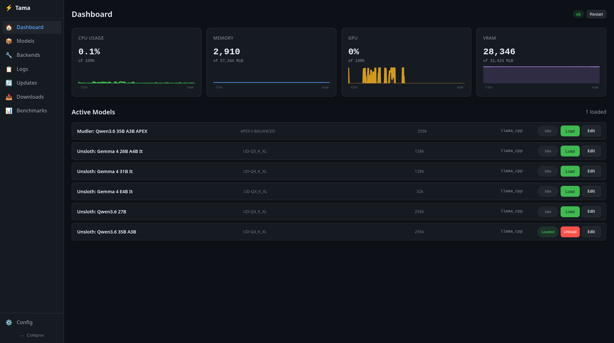

<div align="center">

# Koji

> A local AI server with automatic backend management and a web-based control plane

[](LICENSE)
[](https://www.rust-lang.org)
[](https://github.com/danielcherubini/koji/actions)

[Overview](#overview) • [Quick Start](#quick-start) • [Web UI](#web-ui) • [CLI Reference](#cli-reference) • [Configuration](#configuration) • [Architecture](#architecture)

</div>



## Overview

Koji is a local AI server written in Rust that provides an OpenAI-compatible API on a single port. It automatically manages backend lifecycles — starting models on demand, routing requests, and unloading idle models to save resources.

**Key features:**

- **OpenAI-compatible API** — Works with any client that supports the OpenAI API format
- **Automatic backend management** — Starts, routes, and unloads llama.cpp/ik_llama backends on demand
- **Web-based control plane** — Browser UI for managing models, viewing logs, and editing configuration
- **GPU acceleration** — Supports CUDA, Vulkan, Metal, and ROCm
- **Cross-platform** — Windows, Linux, and macOS support with native service integration
- **Model optimization** — Automatically detects VRAM and suggests optimal quantizations and context sizes

---

## Quick Start

### Installation

**Windows:** Download the installer from [Releases](https://github.com/danielcherubini/koji/releases), or:

```bash
cargo install --git https://github.com/danielcherubini/koji koji
```

**Linux (Debian/Ubuntu):**

```bash
sudo dpkg -i koji_*.deb
```

**Linux (Fedora/RHEL):**

```bash
sudo rpm -i koji-*.rpm
```

### Run Koji

```bash
koji service install
koji service start
```

> [!TIP]
> On Windows, Koji registers as a native Windows Service with firewall configuration. On Linux, it creates a systemd user unit.

---

## Web UI

Koji includes a web-based control plane for managing models, viewing logs, and editing configuration from your browser.

### Running the web UI

The web server starts automatically alongside the proxy when using `koji service start`.

For development or manual startup:

```bash
cargo run --package koji --features web-ui -- web --port 11435
```

Open [http://localhost:11435](http://localhost:11435) to access the dashboard.

> [!NOTE]
> The web UI proxies all `/koji/v1/` requests to the running Koji proxy (default `http://127.0.0.1:11434`).

### Dashboard features

- **Models page** — View installed models, pull new ones from HuggingFace, edit model configurations
- **Backends page** — Manage llama.cpp and ik_llama installations, update versions
- **Logs viewer** — Real-time log streaming with filtering
- **Config editor** — Edit configuration directly from the browser
- **Model status tiles** — See which models are running, their active backends, and job logs

---

## CLI Reference

### Server management

| Command | Description |
|---------|-------------|
| `koji serve` | Start the OpenAI-compatible API server (port 11434) |
| `koji status` | Show status of all servers and running models |
| `koji service install` | Install as a system service |
| `koji service start` | Start the service |
| `koji service stop` | Stop the service |
| `koji service restart` | Restart the service |
| `koji service remove` | Remove the service |

### Model management

| Command | Description |
|---------|-------------|
| `koji model pull <repo>` | Pull a model from HuggingFace |
| `koji model ls` | List installed models |
| `koji model create` | Create a model config from an installed model |
| `koji model enable <name>` | Enable a model for on-demand loading |
| `koji model disable <name>` | Disable a model |
| `koji model rm <model>` | Remove an installed model |
| `koji model scan` | Scan for untracked GGUF files |
| `koji model search <query>` | Search HuggingFace for GGUF models |
| `koji model update [model]` | Check for and download model updates |
| `koji model verify [model]` | Verify GGUF files against HuggingFace hashes |
| `koji model prune` | Remove orphaned GGUF files |

### Backend management

Koji manages LLM backend installations with automatic version tracking:

```bash
koji backend install llama_cpp     # Download pre-built llama.cpp binaries
koji backend install ik_llama      # Build from source
koji backend install llama_cpp --version b8407  # Specific version
koji backend install llama_cpp --build    # Force build from source
koji backend update <name>         # Update to latest version
koji backend list                  # List installed backends
koji backend remove <name>        # Remove a backend
koji backend check-updates         # Check for updates
```

### Server management

```bash
koji server ls                    # List all servers with status
koji server add <name> <cmd>      # Add a new server
koji server edit <name> <cmd>     # Edit an existing server
koji server rm <name>             # Remove a server
```

### Sampling profiles

```bash
koji profile list                  # List all available profiles
koji profile set <server> <name>  # Set a server's sampling profile
koji profile clear <server>        # Clear a server's sampling profile
```

### Configuration

| Command | Description |
|---------|-------------|
| `koji config show` | Print the current configuration |
| `koji config edit` | Open config file in editor |
| `koji config path` | Show the config file path |

### Utilities

| Command | Description |
|---------|-------------|
| `koji logs [name]` | View logs (defaults to proxy logs) |
| `koji run <name>` | Run a single backend for debugging |
| `koji bench [name]` | Benchmark model inference |
| `koji self-update` | Update Koji to the latest version |

---

## Configuration

Koji auto-generates a config on first run:

- **Windows:** `%APPDATA%\koji\config.toml`
- **Linux/macOS:** `~/.config/koji/config.toml`

```toml
[backends.llama_cpp]
path = "/path/to/llama-server"
health_check_url = "http://localhost:8080/health"

[models.my-model]
backend = "llama_cpp"
model = "bartowski/OmniCoder-8B-GGUF"
quant = "Q4_K_M"
profile = "coding"
enabled = true

[proxy]
host = "0.0.0.0"
port = 11434
idle_timeout_secs = 300
startup_timeout_secs = 120

[supervisor]
restart_policy = "always"
max_restarts = 10
restart_delay_ms = 3000
health_check_interval_ms = 5000
```

### Directory layout

```
~/.config/koji/
├── config.toml              Main configuration
├── koji.db                   SQLite database (models, backends, pull history)
├── configs/                 Model cards with quant info and sampling presets
│   └── bartowski--OmniCoder-8B.toml
├── models/                  GGUF model files
│   └── bartowski/OmniCoder-8B/*.gguf
├── backends/                llama.cpp and ik_llama binaries
└── logs/                    Service logs
```

> [!NOTE]
> On first run after upgrading from kronk, Koji automatically migrates `~/.config/kronk` to `~/.config/koji`.

### GPU acceleration

The installer detects your GPU and offers these acceleration options:

- **CUDA** (NVIDIA) — Fast inference on NVIDIA GPUs
- **Vulkan** (AMD/Intel/NVIDIA) — Cross-platform GPU acceleration
- **Metal** (Apple Silicon) — Native macOS GPU acceleration
- **ROCm** (AMD) — AMD GPU support on Linux
- **CPU** — Fallback when no GPU is available

---

## Architecture

```
koji/
├── crates/
│   ├── koji-core/       # Config, process supervisor, proxy, platform abstraction
│   ├── koji-cli/        # CLI binary with clap
│   ├── koji-mock/       # Mock LLM backend for testing
│   └── koji-web/        # Leptos web control plane (WASM + SSR)
├── config/              # Configuration templates
├── docs/                # Documentation
├── installer/           # Windows Inno Setup script
└── modelcards/         # Community model cards
```

### Core components

- **koji-core** — Config management, process supervision, backend registry, proxy server, database
- **koji-cli** — Command-line interface with clap, interactive prompts with inquire
- **koji-web** — Leptos WASM frontend with real-time updates, SSR server for hosting
- **koji-mock** — Mock backend for testing and development

### How it works

1. `koji serve` (or `koji service start`) starts an OpenAI-compatible API server on port 11434
2. When a request arrives with `"model": "my-model"`, koji looks up the config
3. If the backend isn't running, koji auto-assigns a free port and starts it
4. The request is forwarded to the backend and the response is streamed back
5. After `idle_timeout_secs` of inactivity, the backend is shut down

---

## Building from source

```bash
git clone https://github.com/danielcherubini/koji.git
cd koji
cargo build --release
```

The binary is at `target/release/koji.exe` (Windows) or `target/release/koji` (Linux).

For development with the web UI:

```bash
# Install trunk for frontend builds
cargo install trunk

# Build and run with web features
cargo run --package koji --features web-ui -- web
```

---

## Roadmap

- **TUI Dashboard** — Terminal UI with ratatui for resource monitoring
- **System tray** — Quick service toggle from the system tray
- **Tauri GUI** — Lightweight desktop frontend for non-CLI users
